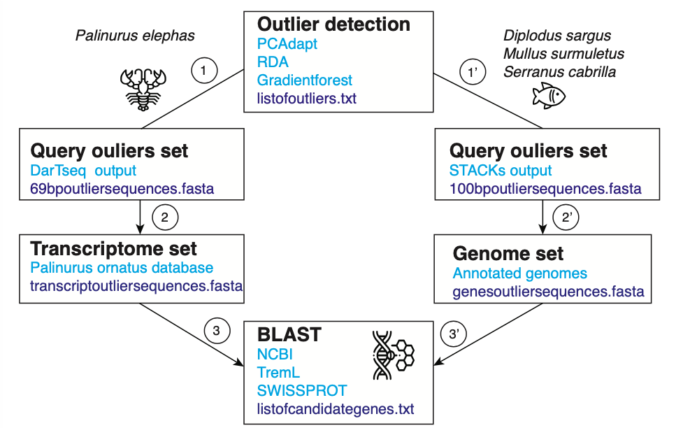

# Codes for the identifying candidate genes in a Next Generation Sequencing (NGS) dataset

#### Laura Benestan, Pierre-Edouard Guérin

Montpellier 03-April 2020

_______________________________________________________________________________

Performing an efficient Basic Local Alignment Search Tool (BLAST) on RAD-sequencing and DarTseq datasets may sometimes be tricky. Before using this ubiquitous tool (BLAST), several steps are required that goes from outlier detection to identifying gene candidates. 

Indeed, knowning which file contains the sequence and ID information for RAD-seq and Dartseq librairies is not so obvious, particularly in the case you end up discovering that the fasta sequences identification names are different from those of the vcf files, and so on.

To avoid such difficulties, we create this "BLAST" pipeline, see the flow chart below.


## Step 0. Prepare your computer

### Install BLAST
To easily install NCBI BLAST tool, you can follow the nice tutorial done by [Eric Normandeau](https://github.com/enormandeau/ncbi_blast_tutorial)

First you can download the NCBI database, which contains all the sequences available worldwide, to do so run:
```{r, engine = 'bash', eval = FALSE}
update_blastdb.pl --decompress nr [*]
```

### Download databases
After downloading this database, you need to convert it in the right format by using the ``makeblastdb`` tool.
```{r, engine = 'bash', eval = FALSE}
makeblastdb -in reference.fasta -title reference -dbtype nucl -out databases/reference
```

You can do the same with the [SWISSPROT database](https://www.uniprot.org/uniprot/?query=reviewed:yes). 
The SWISSPROT database contains the collection of functional information on proteins, with accurate, consistent and rich annotation. 
This database concerns mostly model species where such annotation is available and then is restricted less than 600,000 proteins/genes.

## Step 1. Create your query sequences from outlier detection list of SNPs

BLAST looks for matching query sequences, here the sequences where on outlier has been found, and a database (e.g. NCBI).

In our case we have two sets of query sequences per species:
- a large set : all the sequences of genes that were genotyped on individuals using RAD-seq libraries
- a small set : only the sequences containing the potential outlier SNPs
The idea is to compare these two sets of sequences at the end for the enrichment analyses if there is enough genes identified as potential candidate.

---- **Step 1' - RAD-seq library** ---------------------------------------------------

### Retrieving the files indicating the raw sequences (fasta) and the ID (name of the loci) from RAD-seq libraries

When you finish to run STACKs, you will end up having a file named **populations.loci.fa** by specifying the `--fasta_loci option`. 
This file contains the per-locus consensus FASTA output that you can easily use to perform BLAST alignment in NCBI. 

### Extracting the sequence ID that were found to be outliers

You probably used one population-differentiated (PD) or Genotype-Environmental-Association (GEA) approach to detect a list of putative outlier SNPs.

Here, I used PCAdapt program to detect a list of putative outlier SNPs (see files for each species named `number ofoutliers_pcadapt_speciesname`. 

These SNPs are located on a sequence and then you first want to extract the  outlier SNPs sequences from the file **populations.loci.fa**.

To do so you can transform the fasta file in a text file format.
```{r, engine = 'bash', eval = FALSE}
grep -v '^>' fastafile >newfile
```

From this new file you can now use a script `line.extract.py` (that you can find in (Eric Normandeau github page)[https://github.com/enormandeau/Scripts] to obtain a sequence for each outlier SNP.

--- **Step 1 - DarTseq libraries**  ---------------------------------------------------

**DartSeq** is a genotyping-by-sequencing system that sequence the most informative representations of genomic DNA samples to help marker discovery. 

### Rename the ID number (3th column in the vcf) to match the ID found by the outlier detection analyses
Create a file saving the beginning of the ID number, i.e. remove the "|F|...." from the ID names.
```{r, engine = 'bash', eval = FALSE}
grep -v -E "#" 64057snps_468ind.recode.vcf | cut -f 3 | sed 's/|.*//g' > id_easy_serran.txt
```

Remove the beginning, i.e. "#" of the vcf file
```{r, engine = 'bash', eval = FALSE}
grep -v -E "#" 64057snps_468ind.recode.vcf > test.vcf
```

Copy the ID names saved in the file id_easy_serran.txt in the new vcf file.
```{r, engine = 'bash', eval = FALSE}
awk 'NR==FNR{a[NR]=$0;next} {$3=a[FNR]}1' OFS="\t" id_easy_serran.txt test.vcf > test2.vcf
```

To have a vcf file that works, you can simply copy paste the beginning of your previous vcf file in h terminal by typing
```{r, engine = 'bash', eval = FALSE}
head -n 3 64057snps_468ind.recode.vcf > header.vcf
cat header.vcf test2.vcf > test3.vcf
```

### Find the informations containing the sequences and the name of each sequence in the file sent by the DarT company

In the .csv file gave by DarT company, there is a list of sequences (3rd column) and their ID names (2nd column). 
```{r, engine = 'bash', eval = FALSE}
grep -v "*" Report_DSpl19-4025_SNP_2.csv | cut -d "," -f 2,3 | sort | uniq > sequences_palinurus.txt
```

Extract the ID number found to be putative outliers from the file sequences_palinurus.txt that contains each ID + sequences information.

### From sequences prepare fasta format
```{r, engine = 'bash', eval = FALSE}
awk '{ printf ">%s\n%s\n",$1,$2 }' sequencesoutliers_palinurus.txt | tr ';' '\n' > diplodus_outliers.fasta
```

## Step 2. BLAST your query outlier sequences to your transcriptome or genome to get longer DNA fragments

In this step, the two main goals here are:
- to keep only coding DNA fragments as we are looking for candidate genes
- to match the query outliers sequences to larger sequences of the genome or the transcriptome to potimize the BLAST search

Indeed, a query sequence is said to hit a target sequence if they share a certain percent of similairty (number of nucleotide having the same position along the fragment), determined by a particular set of rules (e.g. allowing gaps or not). 

Because in larger subject sets some good matches are likely to be found by chance, the BLAST search is associated with a “E value,” representing the expected number of matches one might find by chance in a subject set of that size with that score or better. To learn more about the BLAST search tool, see teh great tutorial done by [Oregon University](https://open.oregonstate.education/computationalbiology/chapter/command-line-blast/)

For example, an E value of 0.05 means that we can expect a match by chance in 1 in 20 similar searches, whereas an E value of 2.0 means we can expect 2 matches by chance for each similar search.


## 3. BLAST on existing database available online

When you have finished to get longer outlier sequences from yoru transcriptome/genome, you can now run the blast command using your dataset containing outlier SNPs sequences (sequences.fasta) on the NCBI database.

```{r, engine = 'bash', eval = FALSE}
blastn -db databases/reference -query sequences.fasta -evalue 1e-3 -word_size 11 -outfmt 0 > sequences.reference
```

## 4. METABOLIC PATHWAY

GO terms highly depends on the database used to perform the BLAST. 
Then, using several databases such as those available in KEGGS may be of interest to not make any too rqpid conclusion qbout the categorical GO terms found.

To do so, we used KEGGS to annotate our gene list with GO terms. 
